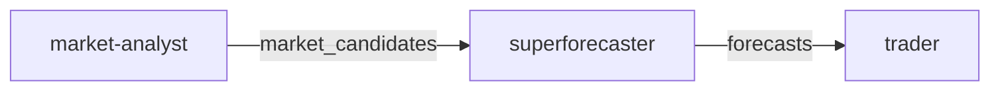

# Agents Overview

polymarket-go uses [multi-agent-spec](https://github.com/plexusone/multi-agent-spec) format for defining AI agents. This allows the same agent definitions to be deployed across different platforms.

## Agent Team

The default trading team consists of three specialized agents:



| Agent | Role | Model | Tools |
|-------|------|-------|-------|
| [market-analyst](market-analyst.md) | Discover opportunities | sonnet | WebSearch, WebFetch, Read, Write |
| [superforecaster](superforecaster.md) | Generate probabilities | sonnet | WebSearch, WebFetch, Read |
| [trader](trader.md) | Execute trades | haiku | Read, Write |

## Agent Definition Format

Agents are defined in Markdown files with YAML frontmatter:

```markdown
---
name: agent-name
namespace: optional-namespace
description: What the agent does
model: sonnet|opus|haiku
tools: [Tool1, Tool2]
role: Agent's role
goal: What the agent tries to achieve
backstory: Background context
dependencies: [other-agent]
---

# Instructions

Detailed instructions for the agent in Markdown format.
```

### Required Fields

| Field | Type | Description |
|-------|------|-------------|
| `name` | string | Unique agent identifier |
| `model` | string | LLM model to use |
| `tools` | array | Available tools |

### Optional Fields

| Field | Type | Description |
|-------|------|-------------|
| `namespace` | string | Agent namespace (derived from directory if not set) |
| `description` | string | Brief description |
| `role` | string | Agent's role in the team |
| `goal` | string | Primary objective |
| `backstory` | string | Context and background |
| `dependencies` | array | Other agents this one depends on |

## Workflow Types

The team workflow supports multiple execution patterns:

### Deterministic (Schema-Controlled)

| Type | Description |
|------|-------------|
| `chain` | Sequential execution A → B → C |
| `scatter` | Parallel execution, results merged |
| `graph` | DAG-based with dependencies |

### Self-Directed (Agent-Controlled)

| Type | Description |
|------|-------------|
| `crew` | CrewAI-style delegation |
| `swarm` | OpenAI Swarm-style handoffs |
| `council` | Multi-agent deliberation |

## Deployment Targets

The same agent specs can deploy to:

| Platform | Config File | Use Case |
|----------|-------------|----------|
| Go Server | `deployment-go-server.json` | Production |
| Claude Code | `deployment-claude-code.json` | Development |

See [Team Configuration](team.md) for workflow and deployment details.
