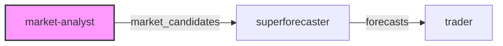

# Market Analyst

The Market Analyst agent discovers trading opportunities by analyzing Polymarket prediction markets.

## Specification

| Field | Value |
|-------|-------|
| **Name** | `market-analyst` |
| **Model** | `sonnet` |
| **Tools** | WebSearch, WebFetch, Read, Write |
| **Role** | Market Research Analyst |
| **Goal** | Identify mispriced markets with >10% expected edge |

## Responsibilities

1. **Market Discovery**: Scan active markets for potential opportunities
2. **Price Analysis**: Compare current market prices to fair value estimates
3. **Edge Calculation**: Identify markets where probability estimate differs significantly from market price
4. **Risk Assessment**: Flag markets with liquidity concerns or resolution ambiguity

## Analysis Framework

When analyzing a market:

1. **Understand the Question**: Parse the exact resolution criteria
2. **Gather Evidence**: Search for relevant news, data, and expert opinions
3. **Base Rate Analysis**: Consider historical frequencies for similar events
4. **Update on Evidence**: Adjust probability based on current information
5. **Compare to Market**: Calculate edge = (fair_value - market_price) / market_price

## Output Format

```json
{
  "market_id": "string",
  "question": "string",
  "current_price": 0.0,
  "fair_value_estimate": 0.0,
  "confidence": "low|medium|high",
  "edge_percent": 0.0,
  "rationale": "string",
  "key_evidence": ["string"],
  "risks": ["string"],
  "recommendation": "buy|sell|avoid"
}
```

## Constraints

- Only analyze markets with >$10k liquidity
- Focus on markets resolving within 30 days
- Avoid markets with ambiguous resolution criteria
- Do not recommend positions with <5% expected edge

## Workflow Position



The Market Analyst is the first step in the workflow, outputting `market_candidates` to the [Superforecaster](superforecaster.md).

## Source

See the full spec at [`agents/specs/agents/market-analyst.md`](https://github.com/grokify/polymarket-go/blob/main/agents/specs/agents/market-analyst.md).
