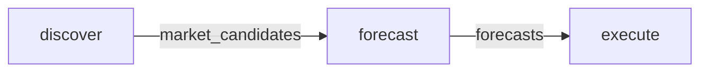

# Team Configuration

The team configuration defines how agents work together in a workflow.

## Team Specification

```json
{
  "name": "polymarket-trading-team",
  "version": "0.1.0",
  "description": "Autonomous trading team for Polymarket prediction markets",
  "agents": ["market-analyst", "superforecaster", "trader"],
  "workflow": {
    "type": "graph",
    "steps": [...]
  }
}
```

## Workflow

The team uses a **graph** workflow type with three steps:



### Step 1: Discover

| Property | Value |
|----------|-------|
| **Agent** | market-analyst |
| **Dependencies** | None |

**Inputs:**

| Name | Type | Default |
|------|------|---------|
| `market_filters` | object | `{min_liquidity: 10000, max_days_to_resolution: 30, active: true}` |

**Outputs:**

| Name | Type | Description |
|------|------|-------------|
| `market_candidates` | array | List of markets with potential edge |

### Step 2: Forecast

| Property | Value |
|----------|-------|
| **Agent** | superforecaster |
| **Dependencies** | discover |

**Inputs:**

| Name | Type | Source |
|------|------|--------|
| `markets` | array | `discover.market_candidates` |

**Outputs:**

| Name | Type | Description |
|------|------|-------------|
| `forecasts` | array | Calibrated probability estimates |

### Step 3: Execute

| Property | Value |
|----------|-------|
| **Agent** | trader |
| **Dependencies** | forecast |

**Inputs:**

| Name | Type | Source |
|------|------|--------|
| `forecasts` | array | `forecast.forecasts` |
| `bankroll` | number | (provided at runtime) |

**Outputs:**

| Name | Type | Description |
|------|------|-------------|
| `trades` | array | Executed trades |
| `positions` | array | Current positions after execution |

## Deployment Configurations

### Go Server

File: `agents/specs/deployment-go-server.json`

```json
{
  "platform": "go-server",
  "team": "polymarket-trading-team",
  "config": {
    "server": {
      "port": 8080,
      "metrics_port": 9090
    },
    "concurrency": {
      "max_concurrent_agents": 3,
      "step_timeout_seconds": 300
    },
    "llm": {
      "provider": "omnillm"
    },
    "polymarket": {
      "clob_url": "https://clob.polymarket.com",
      "gamma_url": "https://gamma-api.polymarket.com"
    },
    "risk": {
      "max_position_percent": 10,
      "max_exposure_percent": 50,
      "min_edge_percent": 5,
      "kelly_multiplier": 0.25
    }
  }
}
```

### Claude Code

File: `agents/specs/deployment-claude-code.json`

```json
{
  "platform": "claude-code",
  "team": "polymarket-trading-team",
  "config": {
    "agent_dir": "agents/specs/agents",
    "spec_dir": "agents/specs",
    "model_mapping": {
      "sonnet": "sonnet",
      "opus": "opus",
      "haiku": "haiku"
    }
  }
}
```

## Source

See the full configuration at [`agents/specs/team.json`](https://github.com/grokify/polymarket-go/blob/main/agents/specs/team.json).
