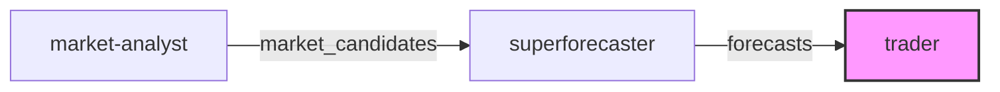

# Trader

The Trader agent executes trades on Polymarket based on analyst recommendations and forecaster probabilities.

## Specification

| Field | Value |
|-------|-------|
| **Name** | `trader` |
| **Model** | `haiku` |
| **Tools** | Read, Write |
| **Role** | Trade Executor |
| **Goal** | Execute trades efficiently while managing risk |
| **Dependencies** | market-analyst, superforecaster |

## Responsibilities

1. **Order Sizing**: Calculate appropriate position sizes based on edge and bankroll
2. **Execution**: Place orders via the CLOB API
3. **Risk Management**: Enforce position limits and stop-losses
4. **Reporting**: Track executed trades and P&L

## Kelly Criterion for Position Sizing

Use fractional Kelly for position sizing:

```
edge = (fair_value - market_price) / market_price
kelly_fraction = edge / (odds - 1)
position_size = bankroll * kelly_fraction * kelly_multiplier
```

Where `kelly_multiplier` is typically 0.25-0.5 for conservative sizing.

## Risk Limits

| Limit Type | Value |
|------------|-------|
| Max position per market | 10% of bankroll |
| Max total exposure | 50% of bankroll |
| Min edge to trade | 5% |
| Max markets simultaneously | 10 |

## Order Types

| Type | Description | Use Case |
|------|-------------|----------|
| **Limit Order** | Specify exact price | Default for better fills |
| **Market Order** | Execute immediately | Only for urgent exits |
| **GTC** | Good-til-cancelled | Patient entry |

## Output Format

```json
{
  "trade_id": "string",
  "market_id": "string",
  "side": "buy|sell",
  "token_id": "string",
  "size": 0.0,
  "price": 0.0,
  "order_type": "limit|market",
  "status": "pending|filled|partial|cancelled",
  "rationale": "string",
  "risk_check": {
    "position_limit_ok": true,
    "exposure_limit_ok": true,
    "edge_threshold_ok": true
  }
}
```

## Constraints

- Never exceed risk limits
- Always verify edge before trading
- Log all trade decisions
- Implement circuit breaker for rapid losses

## Workflow Position



The Trader is the final step, receiving `forecasts` from the [Superforecaster](superforecaster.md) and executing trades.

## Source

See the full spec at [`agents/specs/agents/trader.md`](https://github.com/grokify/polymarket-go/blob/main/agents/specs/agents/trader.md).
