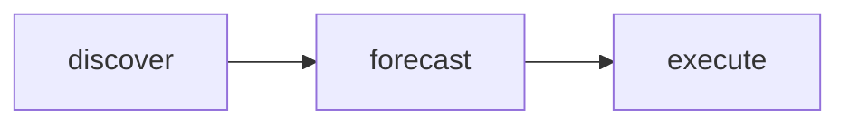

# Workflow Executor

The executor package provides workflow execution for multi-agent-spec teams.

## Import

```go
import "github.com/grokify/polymarket-go/internal/executor"
```

## Executor

The core executor that runs individual workflow steps.

### Creating an Executor

```go
func New(cfg Config) *Executor

type Config struct {
    LLM      provider.Provider  // LLM provider (required)
    Logger   *slog.Logger       // Logger (optional, defaults to slog.Default())
    MaxSteps int                // Maximum steps (optional, defaults to 100)
}
```

**Example:**

```go
exec := executor.New(executor.Config{
    LLM:      llmProvider,
    Logger:   slog.Default(),
    MaxSteps: 50,
})
```

### ExecuteStep

Execute a single workflow step.

```go
func (e *Executor) ExecuteStep(ctx context.Context, step Step) (*StepResult, error)
```

**Step Definition:**

| Field | Type | Description |
|-------|------|-------------|
| `Name` | string | Step identifier |
| `AgentName` | string | Agent to execute this step |
| `Instructions` | string | System instructions for the agent |
| `Inputs` | map[string]any | Input data for the step |
| `DependsOn` | []string | Steps that must complete first |

**Example:**

```go
result, err := exec.ExecuteStep(ctx, executor.Step{
    Name:         "analyze",
    AgentName:    "market-analyst",
    Instructions: "Analyze markets for trading opportunities...",
    Inputs: map[string]any{
        "min_liquidity": 10000,
        "max_days":      30,
    },
})
if err != nil {
    log.Fatal(err)
}
fmt.Println(result.Outputs["response"])
```

### StepResult

```go
type StepResult struct {
    StepName string         // Step that was executed
    Outputs  map[string]any // Output data
    Error    error          // Execution error if any
}
```

### GetStepResult

Retrieve a cached step result.

```go
func (e *Executor) GetStepResult(stepName string) (*StepResult, bool)
```

### Reset

Clear the step cache for a fresh workflow run.

```go
func (e *Executor) Reset()
```

## WorkflowExecutor

Runs complete multi-step workflows with dependency resolution.

### Creating a WorkflowExecutor

```go
func NewWorkflowExecutor(executor *Executor, agents map[string]AgentSpec) *WorkflowExecutor
```

**AgentSpec:**

```go
type AgentSpec struct {
    Name         string   // Agent identifier
    Instructions string   // System prompt
    Model        string   // LLM model to use
    Tools        []string // Available tools
}
```

**Example:**

```go
agents := map[string]executor.AgentSpec{
    "market-analyst": {
        Name:         "market-analyst",
        Instructions: "You are a market research analyst...",
        Model:        "sonnet",
        Tools:        []string{"WebSearch", "Read"},
    },
    // ... more agents
}

wfExec := executor.NewWorkflowExecutor(exec, agents)
```

### Execute

Run a complete workflow.

```go
func (w *WorkflowExecutor) Execute(
    ctx context.Context,
    workflow Workflow,
    inputs map[string]any,
) (map[string]any, error)
```

**Example:**

```go
workflow := executor.Workflow{
    Name: "trading-pipeline",
    Type: executor.WorkflowTypeGraph,
    Steps: []executor.WorkflowStep{
        {
            Name:  "discover",
            Agent: "market-analyst",
            Outputs: []executor.Port{
                {Name: "market_candidates", Type: "array"},
            },
        },
        {
            Name:      "forecast",
            Agent:     "superforecaster",
            DependsOn: []string{"discover"},
            Inputs: []executor.Port{
                {Name: "markets", From: "discover.market_candidates"},
            },
            Outputs: []executor.Port{
                {Name: "forecasts", Type: "array"},
            },
        },
    },
}

results, err := wfExec.Execute(ctx, workflow, map[string]any{
    "min_liquidity": 50000,
})
```

## Workflow Types

```go
type WorkflowType string

const (
    WorkflowTypeChain   WorkflowType = "chain"   // Sequential execution
    WorkflowTypeScatter WorkflowType = "scatter" // Parallel fan-out
    WorkflowTypeGraph   WorkflowType = "graph"   // DAG-based execution
    WorkflowTypeCrew    WorkflowType = "crew"    // CrewAI-style delegation
    WorkflowTypeSwarm   WorkflowType = "swarm"   // OpenAI Swarm handoffs
    WorkflowTypeCouncil WorkflowType = "council" // Deliberation-based
)
```

### Deterministic vs Self-Directed

| Type | Control | Description |
|------|---------|-------------|
| `chain` | Schema | Steps execute in fixed order |
| `scatter` | Schema | Steps execute in parallel |
| `graph` | Schema | DAG with explicit dependencies |
| `crew` | Agent | Agents delegate dynamically |
| `swarm` | Agent | Agents hand off based on context |
| `council` | Agent | Agents deliberate collectively |

```go
// Check workflow control type
if workflow.Type.IsDeterministic() {
    // Schema-controlled execution
} else if workflow.Type.IsSelfDirected() {
    // Agent-controlled execution
}
```

## Port Mapping

Ports connect step outputs to subsequent step inputs.

```go
type Port struct {
    Name string // Port identifier
    Type string // Data type (array, object, string, etc.)
    From string // Source: "step_name.output_name"
}
```

**Example:**

```go
// forecast step receives output from discover step
executor.WorkflowStep{
    Name:      "forecast",
    Agent:     "superforecaster",
    DependsOn: []string{"discover"},
    Inputs: []executor.Port{
        {Name: "markets", From: "discover.market_candidates"},
    },
}
```

## Topological Sorting

The executor automatically sorts workflow steps to respect dependencies:



Steps are executed in dependency order. Cycles are detected and reported as errors.

## Error Handling

```go
results, err := wfExec.Execute(ctx, workflow, inputs)
if err != nil {
    // Check for specific error types
    switch {
    case strings.Contains(err.Error(), "dependency"):
        // Dependency not yet executed or failed
    case strings.Contains(err.Error(), "cycles"):
        // Workflow DAG contains cycles
    case strings.Contains(err.Error(), "agent"):
        // Agent not found in spec
    default:
        // LLM or network error
    }
}
```
